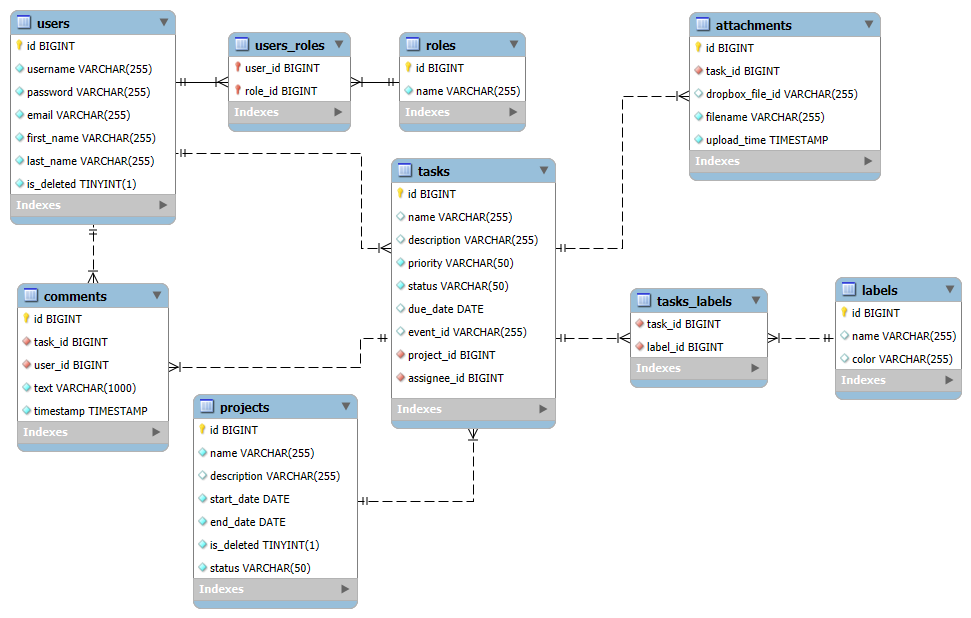
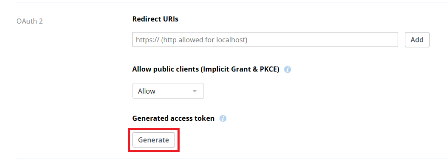

# TaskCrafter API

## 👋 Introduction

Task Crafter is a versatile application designed to help organize workflow at any stage.
This application offers a user-friendly interface for managers, users and administrators,
providing a comprehensive toolset for efficiently managing your projects.
With Dropbox integration, you can attach files, and with Google Calendar integration, no event will go unnoticed. 
This project is focused solely on the backend.

## ✨ Inspiration

This project was inspired by the need for a streamlined, server-side solution to help users manage 
tasks and events efficiently. Task Crafter was designed to simplify the process of organizing workflows 
across various stages, emphasizing ease of use and integration. 
Observing that many existing solutions are overly complicated or lack key integrations, 
I focused on creating a lightweight API that supports both Dropbox for seamless file attachments 
and Google Calendar to ensure no important event is missed. This backend-focused approach allows Task Crafter 
to serve as a solid foundation for future enhancements and client integrations. 
It provides users with a versatile yet straightforward tool for managing their tasks.
___
##  🛠️ Technologies and Tools

### Programing language:

* Java 17: The platform for building and running the application.

### Frameworks:

* Spring Boot: A powerful framework for building Java-based enterprise applications.
* Spring Security: Ensures application security with features such as authentication and authorization.
* Spring Data JPA: Simplifies the data access layer, facilitating interactions with the database.
* Swagger (Spring doc OpenAPI): Enables comprehensive API documentation, easing developer understanding and interaction.

### Database:

  * MySQL: A reliable and scalable relational database management system.
  * H2 (for testing): An in-memory database that provides a lightweight solution for testing and development.

### ORM and Database Versioning:

  * Liquibase: Manages database schema changes and version control.
  * Hibernate:  A robust ORM framework that simplifies database interactions.

### Containerization:

  * Docker: Containerizes the application for consistent and portable deployment.

### Mapping:

  * MapStruct: Simplifies the implementation of mappings between Java bean types.
  * Lombok: Reduces boilerplate code through annotations, enhancing developer productivity.

### Authentication and Security:

  * JSON Web Tokens (jjwt): Ensures secure user authentication.

### External Integrations

  * Google Calendar: Seamlessly integrates with Google Calendar, allowing users to create, view,
and manage events directly from the application. 
This ensures that no event goes unnoticed, enhancing productivity and organization. 
  * Dropbox: Offers convenient file attachment capabilities by integrating with Dropbox. 
Users can attach and access files easily, streamlining document management and collaboration within workflows.

### Testing:

  * Spring Boot Starter Test: A comprehensive testing framework that simplifies the testing of Spring Boot applications.
  * Test-containers (MySQL, JUnit): A Java library that provides lightweight, throwaway instances of common databases and other services for testing.
  * Spring Security Test: A module that supports testing Spring Security components.

### Build Tools:

  * Maven (with Checkstyle and Compiler plugins): A powerful build automation tool for managing project dependencies and lifecycle.
    * Checkstyle plugin: helps maintain code quality by enforcing coding standards.
    * Compiler plugin: ensures the project compiles with the specified Java version, improving build consistency and reliability.
___

## 💾 Database structure

___

## ⚙️ Project Functionalities

### 🩺 Health check:

Available for non log in users.

| HTTP Request | Endpoint  | Description                                                                     |
|:-------------|:----------|:--------------------------------------------------------------------------------|
| **GET**      | `/health` | Сhecks the functionality of the application and the connection to the database. |

### 🛂 User Authentication:

| HTTP Request | Endpoint        | Description                                                   |
|:-------------|:----------------|:--------------------------------------------------------------|
| **POST**     | `/login`        | Login user. Will return a JWT token for authorizing requests. |
| **POST**     | `/registration` | Register as a new users with role "USER"                      |
 
After registration, users need to log in. This is the first and most crucial step.  
Further functionality is restricted based on user roles (user, manager and administrator).

**The application already has a user with the ADMIN role:**
- **Email: admin@example.com**
- **Password: password**  

**For a user with the USER role - it is necessary to register.**  
**For a user with the MANAGER role - it is necessary to register and then changer role(it's available for role MANAGER).**

### 👤 User Management:

* #### For users with the role of "user" or "manager", the following functions are available:
| HTTP Request | Endpoint        | Description                      |
|:-------------|:----------------|:---------------------------------|
| **GET**      | `/users/me`     | View user profile information.   |
| **PUT**      | `/users/me`     | Update user profile information. |

* #### For administrators, the available functions include:
| HTTP Request | Endpoint                    | Description                           |
|:-------------|:----------------------------|:--------------------------------------|
| **PUT**      | `/users/{userId}/roleName`  | Allows you to change the user's role. |

### 📊 Project Management:  
  
* #### For users with the role of "manager", the following functions are available:
| HTTP Request | Endpoint                        | Description               |
|:-------------|:--------------------------------|:--------------------------|
| **POST**     | `/projects`                     | Create a new project.     |
| **GET**      | `/projects/manager`             | Find all projects.        |
| **GET**      | `/projects/manager/{projectId}` | Find any project by id.   |
| **PUT**      | `/projects/{projectId}`         | Update any project by id. |

* #### For users with the role of "user", the available functions include:

| HTTP Request | Endpoint                 | Description                                                          |
|:-------------|:-------------------------|:---------------------------------------------------------------------|
| **GET**      | `/projects`              | Find all projects, which has a task where login user is assignee.    |
| **GET**      | `/projects/{projectId}`  | Find a project by id, which has a task where login user is assignee. |

* #### For users with the role of "admin", the available functions include:

| HTTP Request | Endpoint          | Description                |
|:-------------|:------------------|:---------------------------|
| **DELETE**   | `/projects/{id}`  | Delete any project by id.  |

### 📅 Task Management:

* #### For managers, the following functions are available:
| HTTP Request | Endpoint                               | Description                                    |
|:-------------|:---------------------------------------|:-----------------------------------------------|
| **POST**     | `/tasks/manager`                       | Create a new task, where assignee is any user. |
| **GET**      | `/tasks/manager?projectId={projectId}` | Find all tasks by project id.                  |
| **GET**      | `/tasks/manager/{taskId}`              | Find any task by id.                           |
| **PUT**      | `/tasks/manager/{taskId}`              | Update any task by id.                         |
| **DELETE**   | `/tasks/manager/{taskId}`              | Delete any task by id.                         |

* #### For users, the following functions are available:

| HTTP Request | Endpoint                           | Description                                                                                             |
|:-------------|:-----------------------------------|:--------------------------------------------------------------------------------------------------------|
| **POST**     | `/tasks`                           | Create a new task where assignee is login user and for a project where login user has at least one task |
| **GET**      | `/tasks?projectId={projectId}`     | Find all tasks where assignee is login user, by project id.                                             |
| **GET**      | `/tasks/all?projectId={projectId}` | Find all tasks by project id that you have access to.                                                   |
| **GET**      | `/tasks/{taskId}`                  | Find a task by id where login user is assignee.                                                         |
| **PUT**      | `/tasks/{taskId}`                  | Update a task where login user is assignee by id.                                                       |

### 📌 Labels Management:

* All functions in this section are available to users with the "USER" and "MANAGER" roles.

| HTTP Request | Endpoint        | Description                                 |
|:-------------|:----------------|:--------------------------------------------|
| **POST**     | `/labels`       | Save new label.                             |
| **GET**      | `/labels`       | Find all labels.                            |
| **PUT**      | `/labels/{id}`  | Update a label.                             |
| **DELETE**   | `/labels/{id}`  | Delete a label. Available only for manager. |

### 💬 Comment Management:

* #### For users the following functions are available:
| HTTP Request | Endpoint                           | Description                                              |
|:-------------|:-----------------------------------|:---------------------------------------------------------|
| **POST**     | `/comments`                        | Save new comment for task where login user is assignee.  |
| **GET**      | `/comments?taskId={taskId}`        | Find all comments for task where login user is assignee. |

* #### For managers, the following function is available:

| HTTP Request | Endpoint                             | Description                      |
|:-------------|:-------------------------------------|:---------------------------------|
| **POST**     | `/comments/manager`                  | Save a new comment for any task. |
| **GET**      | `comments/manager/?taskId={taskId}`  | Find all comments for any task.  |

### ☁️ Attachment Management:

* #### For managers the following functions are available:

| HTTP Request | Endpoint                    | Description                                |
|:-------------|:----------------------------|:-------------------------------------------|
| **POST**     | `/attachments/manager`      | Save a new attachment for any task.        |
| **GET**      | `/attachments/manager`      | Find all attachment for any task.          |
| **GET**      | `/attachments/manager/{id}` | Download an attachment by id for any task. |

* #### For users the following functions are available:

| HTTP Request | Endpoint               | Description                                                         |
|:-------------|:-----------------------|:--------------------------------------------------------------------|
| **POST**     | `/attachments`         | Save a new attachment for task where login user is assignee.        |
| **GET**      | `/attachments`         | Find an attachments for task where login user is assignee.          |
| **GET**      | `/attachments/{id}`    | Download an attachment by id for task where login user is assignee. |

---
## ⏳ Preparation before using the application

### 1. Registration on DropBox
| # | Steps                                                                                   |
|:--|:----------------------------------------------------------------------------------------|
| 1 | Registering you account on [**Dropbox**](https://www.dropbox.com/register)              |
| 2 | Create app in [**App Console**](https://www.dropbox.com/developers/apps)                |
| 3 | Generate your access token.   | 
| 4 | Insert your token to ***src/main/resources/application.properties***                    |

### 2. Registration on Google

| #  | Steps                                                                                         |
|:--:|:----------------------------------------------------------------------------------------------|
| 1  | Registering you account on [**Google**](https://www.google.com/intl/ru/account/about/)        |
| 2  | Create app in [**App Console**](https://console.cloud.google.com/apis/library)                |
| 3  | Move to APIs & Services -> Credentials -> Create Credentials -> OAuth Client ID.              |
| 4  | Choose application type - "Desktop app".                                                      |
| 5  | Download client secret in json format.                                                        |
| 6  | Rename this file like: "credentials.json" and insert to ***src/main/resources/google/***      |
| 7  | Create new calendar and insert calendar id to ***src/main/resources/application.properties*** |
| 8  | When you using first time this app, forward link in console and allow access.                 |

## 🐳 How to run this app using Docker
1. Install and run [**Docker**](https://www.docker.com/products/docker-desktop/);
2. Clone repo;
3. Configure all the necessary fields in the .env file;
4. Register on Dropbox and Google [ ⬆️ ](#-preparation-before-using-the-application);
5. Open a terminal and navigate to the root directory of the project on your machine;
6. Build the project by the command `mvn clean install`;
7. Run the application using Docker Compose `docker-compose up`; 

## 🚀 How to use this application
1. Registered a new user.
2. Log in as a an admin.
3. Change the new user’s role to manager.
4. If you want to use the application solely for yourself, enjoy!
5. If using it corporately, please follow these guidelines:
   *  When creating a new project, assign potential assignees by, for example, 
   creating an initial task with project information.
   * After this, assignees will be able to see the projects they have access to and create tasks for themselves.

After these steps use the link:  
 *http:// localhost: SPRING_LOCAL_PORT/swagger-ui/index.html* (SPRING_LOCAL_PORT - configured in the .env file.)  
For example http://localhost:8088/swagger-ui/index.html

Author [*Vitaliy Filimonov*](https://github.com/vfilimo)
